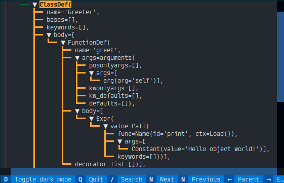

# foldindent - indented text viewer with folding

foldindent is a terminal user interface (TUI) for viewing indented text files with the possibility to fold parts based on indentation.

foldindent can view arbitrary text files.
Each time lines are more indented than previous lines, a foldable point is added in the UI.

## Samples

### Sample: indented JSON data

### Sample: indented python AST dump

(Source sample text generated with `python3 -m ast samples/example.py`)

## Keyboard usage

- `Enter`: fold/expand a node
- `Up/Down`: navigate cursor one node above/below
